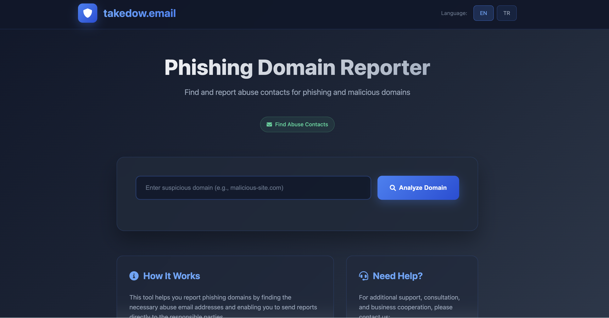

# 🛡️ takedown.email



> **⚠️ ÖNEMLİ BİLGİLENDİRME:** takedown.email projesi 03 Eylül 2026 (2026-09-03) tarihi itibariyle sonlandırılacak ve fişi çekilecektir. Proje, topluluğa katkı ve eğitim amacıyla açık kaynak olarak GitHub'da paylaşılmıştır.

> **⚠️ IMPORTANT NOTICE:** The takedown.email project will be discontinued and shut down as of September 3, 2026 (2026-09-03). The project has been shared on GitHub as open source for the purpose of contributing to the community and providing educational resources.

TR:
Phishing domainleri için abuse contact bilgilerini bulan ve otomatik rapor gönderme sistemi.
EN:
A system that identifies abuse contact information for phishing domains and automatically submits reports.


## Özellikler

- **Domain Sorgulama**: Phishing domain'leri için WHOIS ve IP bilgilerini sorgular
- **Abuse Contact Bulma**: WHOIS kayıtlarından ve IP bilgilerinden abuse email adreslerini otomatik olarak çıkarır
- **Otomatik Mail Template**: Bulunan abuse adreslerine otomatik rapor göndermek için hazır mail template'i
- **Kayıt Sistemi**: Sorgulanan tüm domainleri güvenlik amaçlı kayıt altına alır
- **Admin Paneli**: Sorgulanan domainleri görüntülemek için admin paneli

## Kurulum

### 🐳 Docker ile Kurulum (Önerilen)

#### Hızlı Başlangıç
```bash
# Projeyi klonlayın
git clone <repo-url>
cd takedown.email

# Docker ile çalıştırın (eğer Flask-WTF dependency sorunu varsa)
./docker-fix.sh

# Normal Docker çalıştırma
./docker-run.sh
```

#### Manuel Docker Kurulumu
```bash
# 1. Docker imajını oluşturun
docker build -t takedown-email:latest .

# 2. Konteyner'ı çalıştırın
docker run -d \
  --name takedown-email-app \
  --restart unless-stopped \
  -p 5000:5000 \
  -v "$(pwd)/data:/app/data" \
  takedown-email:latest
```

#### Docker Compose ile Kurulum
```bash
# Geliştirme ortamı için
docker-compose up -d

# Production ortamı için (Nginx ile)
docker-compose --profile production up -d
```

### 🔧 Geleneksel Kurulum

1. **Projeyi klonlayın:**
   ```bash
   git clone <repo-url>
   cd takedown.email
   ```

2. **Virtual environment oluşturun:**
   ```bash
   python3 -m venv venv
   source venv/bin/activate
   ```

3. **Gerekli paketleri kurun:**
   ```bash
   pip install -r requirements.txt
   ```

4. **Uygulamayı çalıştırın:**
   ```bash
   python app.py
   ```

5. **Tarayıcınızda açın:**
   ```
   http://localhost:5000
   ```

## 📋 Kullanım

### Ana Sayfa
1. Şüpheli domain adresini girin (örn: `suspicious-site.com`)
2. "Sorgula" butonuna tıklayın
3. Bulunan abuse email adreslerini görüntüleyin
4. Email adreslerine tıklayarak otomatik rapor gönderin

### Admin Paneli

- **URL**: `http://localhost:5000/security-dashboard-x9k2m8p7q4w1`
- **Kullanıcı adı**: `secadmin`
- **Şifre**: `admin123`

**Güvenlik Notu**: Bu URL ve kimlik bilgileri gizlidir proje yayınlanacaksa değiştirilmeli ve sadece yetkili kişilerle paylaşılmalıdır.

**Admin Panel Özellikleri:**
- **Query Logs**: Tüm domain sorgularının detaylı kayıtları
  - **Arama/Filtreleme**: Domain, IP veya abuse contact'larda arama
  - **Sayfalama**: 20, 50, 100 kayıt gösterme seçenekleri
  - **Export**: CSV ve JSON formatlarında veri dışa aktarma
- **Statistics Dashboard**: Gerçek zamanlı istatistikler ve analitik
  - Toplam sorgu sayıları ve benzersiz domain/IP istatistikleri
  - Günlük ve saatlik aktivite grafikleri
  - En çok sorgulanan domainler ve en aktif IP'ler
  - Interaktif Chart.js grafikleri

## 🐳 Docker Konfigürasyonu

### Environment Variables
```bash
# Flask Configuration
FLASK_ENV=production
FLASK_DEBUG=0
SECRET_KEY=your-super-secret-key-here

# Database Configuration
DATABASE_PATH=/app/data/takedown_logs.db

# Admin Panel Configuration
ADMIN_USERNAME=secadmin
ADMIN_PASSWORD=admin123
ADMIN_URL_PATH=security-dashboard-x9k2m8p7q4w1

# Application Configuration
HOST=0.0.0.0
PORT=5000
```

### Docker Commands
```bash
# Build image
docker build -t takedown-email:latest .

# Run container
docker run -d --name takedown-email-app -p 5000:5000 takedown-email:latest

# View logs
docker logs -f takedown-email-app

# Stop container
docker stop takedown-email-app

# Remove container
docker rm takedown-email-app

# Access container shell
docker exec -it takedown-email-app /bin/bash
```

### Production Deployment
```bash
# With Nginx reverse proxy
docker-compose --profile production up -d

# SSL/TLS configuration
# Edit nginx.conf and add SSL certificates to ./ssl/ directory
```

### 🔧 Troubleshooting

#### Docker Issues

**Problem**: `ImportError: cannot import name 'url_encode' from 'werkzeug.urls'`
```bash
# Solution: Use the fix script
./docker-fix.sh
# Or simple test script
./docker-simple.sh
```

**Problem**: `permission denied while trying to connect to the Docker daemon`
```bash
# Solution: Add user to docker group or use sudo
sudo usermod -aG docker $USER
# Or run with sudo
sudo ./docker-fix.sh
```

**Problem**: Container keeps restarting
```bash
# Check logs
docker logs -f takedown-email-app

# Rebuild with no cache
docker build -t takedown-email:latest . --no-cache
```

#### Application Issues

**Problem**: Rate limiting warnings
```bash
# This is normal for development. For production, configure Redis:
# pip install redis
# Add REDIS_URL environment variable
```

**Problem**: Database permission errors (`sqlite3.OperationalError: unable to open database file`)
```bash
# Solution: Fix data directory permissions
mkdir -p data
chmod 777 data

# Or rebuild with simple script
./docker-simple.sh

# Check container logs for debugging
docker logs -f takedown-email-app
```

## Teknik Detaylar

### Kullanılan Teknolojiler
- **Backend**: Python Flask
- **Database**: SQLite
- **WHOIS**: python-whois paketi
- **DNS**: dnspython paketi
- **Frontend**: HTML5, CSS3, JavaScript (Vanilla)

### Dosya Yapısı
```
takedown.email/
├── app.py                 # Ana Flask uygulaması
├── requirements.txt       # Python bağımlılıkları
├── takedown_logs.db      # SQLite veritabanı (otomatik oluşur)
├── templates/
│   ├── index.html        # Ana sayfa template'i
│   └── admin_logs.html   # Admin paneli template'i
└── venv/                 # Virtual environment
```

### API Endpoints
- `GET /` - Ana sayfa
- `POST /lookup` - Domain sorgulama API'si
- `GET /security-dashboard-x9k2m8p7q4w1` - Güvenli admin paneli (HTTP Basic Auth)
  - **Query Parametreleri**: `page`, `per_page`, `search`
- `GET /security-dashboard-x9k2m8p7q4w1/stats` - İstatistik dashboard'u (HTTP Basic Auth)
- `GET /security-dashboard-x9k2m8p7q4w1/export` - Veri export (HTTP Basic Auth)
  - **Query Parametreleri**: `format` (csv/json), `search`

## Nasıl Çalışır

1. **Domain Sorgulama**: Girilen domain için WHOIS sorgusu yapar
2. **IP Çözümleme**: Domain'in IP adresini bulur
3. **Email Çıkarma**: WHOIS kayıtlarından ve IP WHOIS'inden abuse email adreslerini çıkarır
4. **Template Oluşturma**: Bulunan emailler için otomatik rapor template'i hazırlar
5. **Kayıt**: Tüm sorguları veritabanına güvenlik amaçlı kaydeder

## Email Template

Sistem otomatik olarak şu formatta rapor template'i oluşturur:

```
Dear Abuse Team,

I am writing to report suspicious activity associated with the domain: xxx.com

This domain appears to be involved in potentially malicious activities including but not limited to:
- Phishing attacks
- Fraudulent activities
- Impersonation of legitimate services
- Distribution of malicious content

Domain Details:
- Reported Domain: xxx.com
- Report Date: 2026-07-18 21:26:56 UTC
- Report Source: takedow.email Professional Security Platform

We kindly request that you investigate this domain and take appropriate action according to your abuse policies. If this domain is found to be engaging in malicious activities, please consider suspending or taking down the domain to protect internet users.

Additional evidence or technical details can be provided upon request.

Thank you for your attention to this matter and your efforts in maintaining internet security.

Best regards,
Security Team
takedow.email Professional Platform

```

## Güvenlik

- Tüm domain sorguları IP adresi ve kullanıcı aracısı ile birlikte kaydedilir
- Admin paneli HTTP Basic Auth ile korunur
- SQLite veritabanı local olarak saklanır
- Hassas veriler şifrelenmez (local kullanım için tasarlanmıştır)

## Önemli Notlar

- Bu araç sadece yasal amaçlarla kullanılmalıdır
- Abuse raporları göndermeden önce domain'in gerçekten kötü amaçlı olduğundan emin olun
- WHOIS sorguları rate limit'e tabi olabilir
- Bazı domainler için abuse contact bilgisi bulunamayabilir

## 📄 Lisans

Bu proje MIT lisansı altında lisanslanmıştır.
